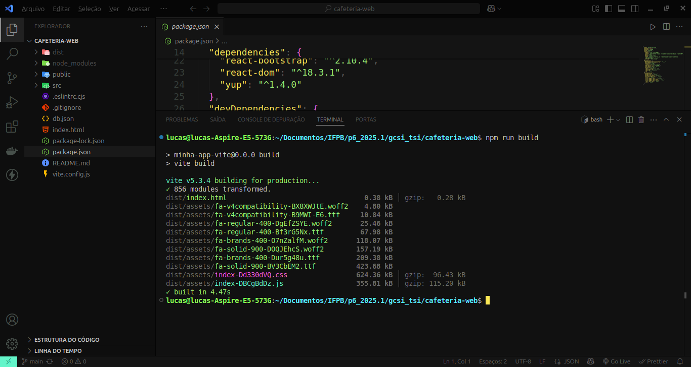

# Atividade 01 de Gerência e Configuração de Serviços para Internet
Esta é a primeira parte da  1ª atividade da disciplina de GCSI ministrada pelo o [Prof. Rhavy Maia](https://github.com/rhavymaia).

A primeira parte desta atividade tem como objetivo:
- subir uma aplicação React para um servidor [Ngnix](https://nginx.org/)
- configurar o redirecionamento das rotas de uma aplicação React no Nginx

## Configuração do Redirecionamento das rotas:
**Etapa 1**
Primeiramente, é necessário ter o Nginx instalado na sua máquina. Caso não tenha, faça a instalação. Para realizar a instalção é simples, é só executar os seguintes comandos abaixo.
- Passo 1 - atualize os repositórios
```
sudo apt update
```

- Passo 2 - instale o Nginx
```
sudo apt install nginx
```
**Etapa 2**
Com o Nginx já instalado, escolha ou crie um projeto em React, para hospedar em um servidor Nginx. Seu projeto deverá ter rotas, para safisfazer o propósito da atividade. Para isso, O React tem uma biblioteca específica para a manipulação de rotas, o [React Router DOM](https://reactrouter.com/home)

Caso o seu projeto esteja com todas as especiicações, Abra-o em uma IDE e digite o seguinte comando abaixo: 
```
npm run build
```
> O `npm run build` cria uma versão da sua apliacação pronta para a produção.

Após executar o comando, a pasta dist é criada no diretório da apliação React:


**Etapa 3**
Aplicação "preparada" para produção, agora é a etapa de hospeder a aplicação no servidor Nginx. Vamos seguir com os seguintes passos:
- Passo 1 - Copie o path da aplicação junto a pasta `dist`:
```
/home/lucas/Documentos/IFPB/p6_2025.1/gcsi_tsi/cafeteria-web/dist
```
- Passo 2 - Abra a pasta **etc/nginx/site-available** e crie uma pasta para executar a configuração da sua aplicação. No caso, eu criei um arquivo chamado **cafeteria.com**:
```
#Abrir a pasta
cd /etc/nginx/sites-available

#Criar o arquivo
sudo nano cafeteria.com
```

- Passo 3 - Informe as seguintes configurações no arquivo **cafeteria.com**:
```
server {
        listen 80;
        listen [::]:80;

        root /home/lucas/Documentos/IFPB/p6_2025.1/gcsi_tsi/cafeteria-web/dist;
        index index.html;

        server_name _;

        ### Configuração para que redirecionamento entre as rotas funcione:
        location / {
                try_files $uri /index.html;
        }
}

```

- Passo 4 - Agora com a configuração da aplicação já pronta, é necessário realizar a "linkagem" da aplicação para ser colocada no "ar". Para fazer isso, referencia a `sites-available/cafeteria.com` a `site/enabled`, desse modo, o Nginx carrega as aplicações que estão em `site/enabled`. Digite o seguinte comando:
```
sudo ln -s /etc/nginx/sites-available/cafeteria.com /etc/nginx/sites-enabled/
```

Passo 5 - Apague os arquivos `default` que vem por padrão nas duas pastas: `sites-availables` e `sites-enabled`, Digite o seguinte comando:
```
sudo rm default
```